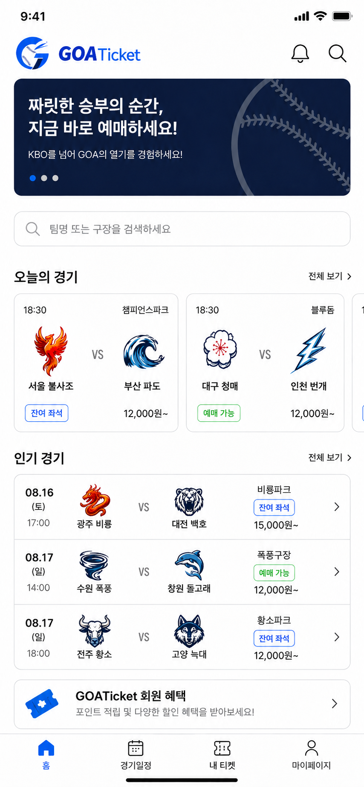

# B2_1_Project_A
AI 기반 UI/UX 디자인 시안 제작

# 작업 로그 문서

| 프로젝트명 | GOATicket APP UI/UX Design |
| --- | --- |
| 의미 | 최고의 선수(G.O.A.T) 경기 티켓 / 'Go Ticket(티켓 잡으러 가자)'의 중의적 표현 |
| 팀원 | 정세현, 권은창, 박유안, 오승욱, 윤태성 |

### 1. 프로젝트 개요

---

| 서비스 한줄 소개 | 국내에서 가장 인기 많은 스포츠인 야구경기의 통합 예매 서비스를 제공하는 어플 |
| --- | --- |
| 핵심 가치 | 각 구단 홈페이지에서 따로 예매해야했던 불편함을 개선하여 야구에 더 편하게 접근하도록 편의성 제공 |
| 사용도구 | ChatGPT(UI 시안 생성), Figma(AI 결과물의 후가공), Claude(프롬프트 가공) |

### 2. 핵심 설계 근거

---

#### 2-1. 워크플로우 설계

해당 프로젝트의 핵심 사용자 목표는 “여러 경기 일정을 한눈에 파악하고 빠르게 예약하는 것"으로 정의하였다. 따라서 경기일정 파악과 예매에 관여하는 중요 카테고리들을 중심으로 워크 플로우를 구성하였다.


#### 2-2. **AI 생성 일관성 유지 프롬프트 전략**

AI모델이 이미지를 생성할때 같은 디자인과 형식을 유지하기에는 어려움이 있다. 그래서 프롬프트에 일관성 유지를 위한 디자인에 관한 지침이 필요하다 생각하였다. 따라서 [getdesign.md](http://getdesign.md) 사이트에서 추구하는 디자인과 유사한 브랜드의 디자인 시스템과 가이드라인을 마크다운 형식의 본문으로 다운받아 활용하였다. 본 프로젝트에서는 Apple사의 디자인 시스템을 사용하였다. 다운받은 본문은 Claude를 통해 프롬프트화 시켜 다양한 이미지를 생성할 때 일관성을 유지할 수 있도록 수정하였다.

예시 프롬프트

> 
> 
> 
> Typography principles:
> 
> - Body copy always at 17pt — never 16pt. The extra point defines the reading pace.
> - Tight letter-spacing (–0.3 to –0.5pt) on display sizes (22pt+).
> - Normal letter-spacing on body and below.
> - Line-height: 1.07–1.15 for large titles · 1.47 for body · 1.3 for labels.
> - Weight 500 is permitted ONLY for tab bar labels (10pt context).
> - All other roles: 300 / 400 / 600 / 700 — no 500.

### 3. 프롬프트 최적화 로그

---

#### 3-1. 디자인 시스템 전문(.md)

- Prompt
    
    ```markdown
    ## Overview
    
    Apple's web presence is a masterclass in **reverent product photography framed by near-invisible UI**. Every page is a stack of edge-to-edge product "tiles" — alternating light and dark canvases, each centered on a hero headline, a one-line tagline, two tiny blue pill CTAs, and an impossibly crisp product render. Nothing competes with the product. Typography is confident but quiet; color is either pure white, an off-white parchment, or a near-black tile; interactive elements are a single, quiet blue.
    
    Density is unusually low even by contemporary SaaS standards. Each tile occupies roughly one viewport, and there is no decorative chrome — no borders, no gradients, no decorative frames, no shadows on headlines. Elevation appears only when a product image rests on a surface (a single soft `rgba(0, 0, 0, 0.22) 3px 5px 30px` drop for visual weight). The result is a catalog that feels more like a museum gallery: the wall disappears and the artifact takes over.
    
    Store and shop surfaces retain the same chassis but switch modes. The product configurator (iPhone 17 Pro, accessories grid) introduces a tight grid of white utility cards at `{rounded.lg}` (18px) radius with a thin border, paired with a persistent thin sub-nav strip. The environment page leans darker and more editorial. Across all five surfaces the typographic system, spacing rhythm, and the single blue accent are consistent — this is one design language expressed at different volumes.
    
    **Key Characteristics:**
    - Photography-first presentation; UI recedes so the product can speak.
    - Alternating full-bleed tile sections: white/parchment ↔ near-black, with the color change itself acting as the section divider.
    - Single blue accent (`{colors.primary}` — #0066cc) carries every interactive element. No second brand color exists.
    - Two button grammars: tiny blue pill CTAs (`{rounded.pill}`) and compact utility rects (`{rounded.sm}`).
    - SF Pro Display + SF Pro Text — negative letter-spacing at display sizes for the signature "Apple tight" headline feel.
    - Whisper-soft elevation used only when a product image needs to breathe — exactly one drop-shadow in the entire system.
    - Tight two-row nav: slim `{component.global-nav}` + product-specific `{component.sub-nav-frosted}` with persistent right-aligned primary CTA.
    - Section rhythm across multiple pages: light hero → dark product tile → light utility tile → dark tile → parchment footer — a predictable pulse.
    
    ## Colors
    
    > **Source pages analyzed:** homepage, environment, store, iPhone 17 Pro buy page, accessories index. The color system is identical across all five surfaces; only the surface-mode mix differs.
    
    ### Brand & Accent
    - **Action Blue** (`{colors.primary}` — #0066cc): The single brand-level interactive color. All text links, all blue pill CTAs ("Learn more", "Buy"), and the focus ring root. This is Apple's quiet but universal "click me" signal. Press state shifts to a slightly darker variant via the active scale transform rather than a hex change.
    - **Focus Blue** (`{colors.primary-focus}` — #0071e3): A marginally brighter sibling of Action Blue, reserved for the keyboard focus ring on buttons (`outline: 2px solid`).
    - **Sky Link Blue** (`{colors.primary-on-dark}` — #2997ff): A brighter blue used on dark surfaces for in-copy links and inline callouts, where Action Blue would disappear against the tile background.
    
    ### Surface
    - **Pure White** (`{colors.canvas}` — #ffffff): The dominant canvas. Content, utility cards, store tiles, configurator grids.
    - **Parchment** (`{colors.canvas-parchment}` — #f5f5f7): The signature Apple off-white. Used for alternating light tiles, footer region, and the default page canvas in store utility sections. Just different enough from white to create rhythm.
    - **Pearl Button** (`{colors.surface-pearl}` — #fafafc): A near-white used as the fill for secondary "ghost" buttons — lighter than the parchment canvas so the button still reads as a button against `{colors.canvas-parchment}`.
    - **Near-Black Tile 1** (`{colors.surface-tile-1}` — #272729): The primary dark-tile surface on the homepage product grid.
    - **Near-Black Tile 2** (`{colors.surface-tile-2}` — #2a2a2c): A micro-step lighter — used where a dark tile sits directly above or below Tile 1 to create the faintest separation.
    - **Near-Black Tile 3** (`{colors.surface-tile-3}` — #252527): A micro-step darker — used at the bottom of the stack and in embedded video/player frames.
    - **Pure Black** (`{colors.surface-black}` — #000000): Reserved for true void — video player backgrounds, edge-to-edge photographic overlays, the global nav bar background.
    - **Translucent Chip Gray** (`{colors.surface-chip-translucent}` — #d2d2d7): The base hex of the translucent gray chip used over photography for circular control buttons. In production, applied at ~64% alpha as `rgba(210, 210, 215, 0.64)`.
    
    ### Text
    - **Near-Black Ink** (`{colors.ink}` — #1d1d1f): The voice of every headline, every body paragraph, and the dark utility button's fill. Chosen instead of pure black to keep the page feeling photographic rather than printed.
    - **Body** (`{colors.body}` — #1d1d1f): Same hex as ink — Apple uses one near-black tone for all text on light surfaces.
    - **Body On Dark** (`{colors.body-on-dark}` — #ffffff): All text on dark tiles and on the global nav bar.
    - **Body Muted** (`{colors.body-muted}` — #cccccc): Secondary copy on dark tiles where pure white would be too loud.
    - **Ink Muted 80** (`{colors.ink-muted-80}` — #333333): Body text on the white Pearl Button surface — slightly softer than pure black.
    - **Ink Muted 48** (`{colors.ink-muted-48}` — #7a7a7a): Disabled button text and legal fine-print.
    
    ### Hairlines & Borders
    - **Divider Soft** (`{colors.divider-soft}` — #f0f0f0): The "border" tone on secondary buttons — functions as a ring shadow rather than a hard line. In production, often applied as `rgba(0, 0, 0, 0.04)`.
    - **Hairline** (`{colors.hairline}` — #e0e0e0): The 1px hairline border on store utility cards and configurator chips.
    
    ### Brand Gradient
    **No decorative gradients.** Atmospheric depth on product photography (the iPhone 17 Pro camera plate, the Apple Watch bands, AirPods reflections) is inherent to the imagery, not a CSS gradient overlay. The environment page's hero uses photographic atmosphere (mountain vista at dawn) but no gradient tokens are defined. Apple is the rare luxury-brand site with zero gradient-based design tokens.
    
    ## Typography
    
    ### Font Family
    - **Display**: `SF Pro Display, system-ui, -apple-system, sans-serif` — Apple's proprietary display face, optimized for sizes ≥ 19px. Defines the voice of every headline.
    - **Body / UI**: `SF Pro Text, system-ui, -apple-system, sans-serif` — the text-optimized variant used for body copy, captions, buttons, and links below 20px.
    - **OpenType features**: `font-variant-numeric: numerator` is enabled on numeric links (pricing tables, spec sheets). Display sizes rely on tight tracking rather than contextual ligatures.
    
    ### Hierarchy
    
    | Token | Size | Weight | Line Height | Letter Spacing | Use |
    |---|---|---|---|---|---|
    | `{typography.hero-display}` | 56px | 600 | 1.07 | -0.28px | Hero headline; the signature "Apple tight" tracking |
    | `{typography.display-lg}` | 40px | 600 | 1.10 | 0 | Tile headlines atop every product tile |
    | `{typography.display-md}` | 34px | 600 | 1.47 | -0.374px | Section heads (SF Pro Text at display proportions) |
    | `{typography.lead}` | 28px | 400 | 1.14 | 0.196px | Product tile subcopy |
    | `{typography.lead-airy}` | 24px | 300 | 1.5 | 0 | Environment-page lead paragraphs (the rare weight 300) |
    | `{typography.tagline}` | 21px | 600 | 1.19 | 0.231px | Sub-tile tagline; sub-nav category name |
    | `{typography.body-strong}` | 17px | 600 | 1.24 | -0.374px | Inline strong emphasis |
    | `{typography.body}` | 17px | 400 | 1.47 | -0.374px | Default paragraph |
    | `{typography.dense-link}` | 17px | 400 | 2.41 | 0 | Footer / store utility link lists (relaxed leading) |
    | `{typography.caption}` | 14px | 400 | 1.43 | -0.224px | Secondary captions, button text |
    | `{typography.caption-strong}` | 14px | 600 | 1.29 | -0.224px | Emphasized captions |
    | `{typography.button-large}` | 18px | 300 | 1.0 | 0 | Store hero CTAs (the rare weight 300) |
    | `{typography.button-utility}` | 14px | 400 | 1.29 | -0.224px | Utility/nav button labels |
    | `{typography.fine-print}` | 12px | 400 | 1.0 | -0.12px | Fine-print, footer body |
    | `{typography.micro-legal}` | 10px | 400 | 1.3 | -0.08px | Micro legal disclaimers |
    | `{typography.nav-link}` | 12px | 400 | 1.0 | -0.12px | Global nav menu items |
    
    ### Principles
    
    - **Negative letter-spacing at display sizes.** Every headline at 17px and up carries a slight tracking tighten (`-0.12 → -0.374px`). This produces the iconic "Apple tight" headline cadence. Never used at 12px or below.
    - **Body copy at 17px, not 16px.** Apple breaks the SaaS convention and runs paragraph text at 17px. The extra pixel gives the page an unmistakable "reading, not scanning" pace.
    - **Weight 300 is real and rare.** Used deliberately on a handful of large-size reads (`{typography.button-large}` at 18px/300 and `{typography.lead-airy}` at 24px/300). It's not an accident — it's a light-atmosphere cue reserved for moments where the content should feel airy.
    - **Weight 600, not 700, for headlines.** Apple's headlines sit at weight 600. Weight 700 is used sparingly for `{typography.tagline}` (21px) when a touch more assertion is needed.
    - **Line-height is context-specific.** Display sizes use 1.07–1.19 (tight). Body uses 1.47. Utility link stacks in the footer/store use an unusually relaxed 2.41 (`{typography.dense-link}`). The 2.41 is not a bug — it's how the footer's dense link columns breathe.
    - **Weight 500 is deliberately absent.** The ladder is 300 / 400 / 600 / 700. Mid-weight readings always use 600.
    
    ### Note on Font Substitutes
    SF Pro is Apple's proprietary system font. When building off-system:
    
    - Use `system-ui, -apple-system, BlinkMacSystemFont` as the first stack entry — on macOS/iOS/Safari this resolves to the real SF Pro.
    - For non-Apple platforms, **Inter** (Google Fonts, variable) is the closest open-source equivalent. Inter at weight 600 with `font-feature-settings: "ss03"` approximates SF Pro's rounded "a" character.
    - Nudge `letter-spacing` down by `-0.01em` on display sizes to re-create the Apple tight feel; Inter's default tracking runs slightly wider than SF Pro.
    - For body text, tighten line-height by `0.03` (from 1.47 → 1.44) when substituting Inter — Inter's taller x-height needs less leading.
    
    ## Layout
    
    ### Spacing System
    - **Base unit:** 8px. Sub-base values (2, 4, 5, 6, 7) are used for tight typographic adjustments; structural layout snaps to 8/12/16/20/24.
    - **Tokens:** `{spacing.xxs}` 4px · `{spacing.xs}` 8px · `{spacing.sm}` 12px · `{spacing.md}` 17px · `{spacing.lg}` 24px · `{spacing.xl}` 32px · `{spacing.xxl}` 48px · `{spacing.section}` 80px.
    - **Section vertical padding:** `{spacing.section}` (80px) inside a product tile; tiles stack edge-to-edge with 0 gap (the color change provides the break).
    - **Card padding:** `{spacing.lg}` (24px) inside utility grid cards.
    - **Button padding:** 8–11px vertical, 15–22px horizontal.
    - **Universal rhythm constants:** the 17px body line-height multiplier (~25px line) and 21px tagline size show up on every analyzed page.
    
    ### Grid & Container
    - **Max content width:** ~980px on text-heavy sections (environment), ~1440px on product grids (store, accessories), full-bleed for product tiles (homepage).
    - **Column patterns:** 3 to 5 column utility card grid on store/accessories; 2-column side-by-side tiles on homepage occasional sections; single-column centered stack on product tile heroes.
    - **Gutters:** 20–24px between cards in a utility grid.
    
    ### Whitespace Philosophy
    Apple's whitespace is the product's pedestal. Every tile begins with at least 64px of air above its headline and 48–64px below. Product renders are never crowded; the nearest content to a product image is at least 40px away. The footer is the only area that breaks this — there, Apple goes deliberately dense to make the full information architecture visible at a glance.
    
    ## Elevation & Depth
    
    | Level | Treatment | Use |
    |---|---|---|
    | Flat | No shadow, no border | Full-bleed tiles, global nav, footer, body sections |
    | Soft hairline | 1px `rgba(0, 0, 0, 0.08)` border | Utility cards, sub-nav frosted-glass separator |
    | Backdrop blur | `backdrop-filter: blur(N)` on Parchment 80% | Sub-nav and the iPhone buy floating sticky bar |
    | Product shadow | `rgba(0, 0, 0, 0.22) 3px 5px 30px 0` | Product renders resting on a surface (the only true "shadow" in the system) |
    
    **Shadow philosophy.** Apple uses **exactly one** drop-shadow, and it is applied to photographic product imagery — never to cards, never to buttons, never to text. Elevation in the UI comes from (a) surface-color change (light tile ↔ dark tile) and (b) backdrop-blur on sticky bars. The single shadow is about giving the product weight, not about UI hierarchy.
    
    ### Decorative Depth
    - **Atmospheric imagery** on the environment page (photographic vista) supplies mood; no CSS gradient involved.
    - **Edge-to-edge tile alternation** creates rhythm without borders or shadows — the color change itself is the divider.
    - **Backdrop-filter blur** on `{component.sub-nav-frosted}` and `{component.floating-sticky-bar}` creates a "floating over content" effect that's functional, not decorative.
    
    ## Shapes
    
    ### Border Radius Scale
    
    | Token | Value | Use |
    |---|---|---|
    | `{rounded.none}` | 0px | Full-bleed product tiles (no corner rounding) |
    | `{rounded.xs}` | 5px | Inline links when styled as subtle chips (rare) |
    | `{rounded.sm}` | 8px | Dark utility buttons (Sign In, Bag), inline card imagery |
    | `{rounded.md}` | 11px | White Pearl Button capsules |
    | `{rounded.lg}` | 18px | Store utility cards, accessories grid cards |
    | `{rounded.pill}` | 9999px | Primary blue pill CTAs, sub-nav buy button, configurator option chips, search input — the signature Apple pill |
    | `{rounded.full}` | 9999px / 50% | Circular control chips floating over photography |
    
    ### Photography Geometry
    - **Hero imagery**: full-bleed, 21:9 or taller on the homepage; 16:9 on environment and shop pages. Product renders are photographic-realistic, often shot on a tinted surface that becomes the tile background.
    - **Product renders**: PNG/WebP with transparency; rest on a surface tile and pick up the system shadow.
    - **Accessory grid**: square 1:1 crops at `{rounded.lg}` (18px) radius, light neutral backgrounds, product centered with 20–40px internal padding.
    - **No rounded imagery in hero tiles** — images are full-bleed rectangular. Rounding (`{rounded.sm}`, `{rounded.lg}`) appears only on inline card imagery.
    - Lazy-loading via responsive `srcset` and `sizes` across all breakpoints; CDN-optimized WebP.
    
    ## Components
    
    ### Top Navigation
    
    **`global-nav`** — Persistent, ultra-thin black nav bar pinned to the top of every page. Background `{colors.surface-black}`, height 44px, text `{colors.on-dark}` in `{typography.nav-link}` (12px / 400 / -0.12px tracking). Links are quiet, spaced ~20px apart, running edge-to-edge across the top. Right-aligned cluster: Search, Bag icons — always visible. On mobile, collapses to hamburger at ~834px and the Apple logo centers.
    
    **`sub-nav-frosted`** — Surface-specific nav that sticks below the global nav. Background `{colors.canvas-parchment}` at 80% opacity with backdrop-filter blur, creating a frosted-glass effect. Height 52px. Content on left: product category name ("iPhone", "Store", "Accessories") in `{typography.tagline}` (21px / 600). Content right: inline nav links in `{typography.button-utility}` (14px), ending in a persistent `{component.button-primary}` ("Buy") or a utility link.
    
    ### Buttons
    
    **`button-primary`** — The signature Apple action. Background `{colors.primary}` (Action Blue #0066cc), text `{colors.on-primary}` in `{typography.body}` (SF Pro Text 17px / 400), rounded `{rounded.pill}` (full pill — capsule-shaped), padding 11px × 22px. The full-pill radius IS the brand action signal.
    - Active state: `{component.button-primary-active}` — `transform: scale(0.95)` (the system-wide micro-interaction).
    - Focus state: `{component.button-primary-focus}` — 2px solid `{colors.primary-focus}` outline.
    
    **`button-secondary-pill`** — Used as the second CTA when two blue pills appear together ("Learn more" / "Buy"). Background transparent, text `{colors.primary}`, 1px solid `{colors.primary}` border, rounded `{rounded.pill}`, padding 11px × 22px. Reads as a "ghost pill."
    
    **`button-dark-utility`** — Global nav actions (Sign In, Bag, language selector). Background `{colors.ink}` (#1d1d1f), text `{colors.on-dark}` in `{typography.button-utility}` (14px / 400 / -0.224px tracking), rounded `{rounded.sm}` (8px), padding 8px × 15px. Active state shrinks via `transform: scale(0.95)`.
    
    **`button-pearl-capsule`** — Product-card secondary button. Background `{colors.surface-pearl}` (#fafafc), text `{colors.ink-muted-80}` in `{typography.caption}` (14px), 3px solid `{colors.divider-soft}` border (functions as a soft ring rather than a visible line), rounded `{rounded.md}` (11px), padding 8px × 14px.
    
    **`button-store-hero`** — A larger primary CTA used on store hero surfaces. Same Action Blue + Paper White as `{component.button-primary}`, but with `{typography.button-large}` (18px / 300 — note the rare weight 300) and slightly more padding (14px × 28px). Used sparingly on the store landing.
    
    **`button-icon-circular`** — Floats over photography. 44 × 44px, background `{colors.surface-chip-translucent}` at ~64% alpha, icon in `{colors.ink}`, rounded `{rounded.full}`. Used for carousel controls, close buttons, and in-image controls (product image thumbnails on the iPhone buy page).
    
    **`text-link`** — Inline body links in `{colors.primary}` (Action Blue). Underlined or non-underlined per context.
    
    **`text-link-on-dark`** — Inline body links on dark tiles in `{colors.primary-on-dark}` (Sky Link Blue #2997ff) — Action Blue would disappear against `{colors.surface-tile-1}`.
    
    ### Cards & Containers
    
    **`product-tile-light`** — Full-bleed light tile. Background `{colors.canvas}` (white), text `{colors.ink}`, rounded `{rounded.none}` (0 — tiles touch edges), vertical padding `{spacing.section}` (80px). Centered stack: product name in `{typography.display-lg}` (40px / 600) → one-line tagline in `{typography.lead}` (28px / 400) → two `{component.button-primary}` CTAs ("Learn more" / "Buy") → product render resting on the surface with the system shadow.
    
    **`product-tile-parchment`** — Same as `{component.product-tile-light}` but on `{colors.canvas-parchment}` (#f5f5f7). Used to break two consecutive white tiles.
    
    **`product-tile-dark`** — Full-bleed dark tile. Background `{colors.surface-tile-1}` (#272729), text `{colors.on-dark}`, rounded `{rounded.none}`, vertical padding `{spacing.section}` (80px). Same content stack as the light tile but with `{component.text-link-on-dark}` for inline copy and `{component.button-primary}` (Action Blue still works on the dark surface). Used on the homepage product grid as the alternating dark band.
    
    **`product-tile-dark-2`** — Variant on `{colors.surface-tile-2}` (#2a2a2c). Used where a dark tile sits directly above or below `{component.product-tile-dark}` to create the faintest separation through micro-step lightness change.
    
    **`product-tile-dark-3`** — Variant on `{colors.surface-tile-3}` (#252527). Used at the bottom of the stack and in embedded video/player frames.
    
    **`store-utility-card`** — Used in store grid and accessories grid. Background `{colors.canvas}` (white), 1px solid `{colors.hairline}` border, rounded `{rounded.lg}` (18px), padding `{spacing.lg}` (24px). Top: product image (1:1 crop with `{rounded.sm}` (8px) inner image radius). Below: product name in `{typography.body-strong}` (17px / 600), price in `{typography.body}` (17px / 400), and a `{component.text-link}` ("Buy" or "Learn more"). No shadow by default; product render itself carries the system product-shadow.
    
    **`configurator-option-chip`** — Pill-shaped tappable cell used in the iPhone 17 Pro buy page. Background `{colors.canvas}`, text `{colors.ink}` in `{typography.caption}`, rounded `{rounded.pill}`, padding 12px × 16px. Contains a small product thumbnail + label + price delta. Arranged in a grid of 4–5 options per row.
    
    **`configurator-option-chip-selected`** — Selected state. Border upgrades to 2px solid `{colors.primary-focus}`. Same shape, same content.
    
    **`environment-quote-card`** — A photographic-canvas hero specific to the environment page. Dark photographic backdrop (mountain vista at dawn) with `{colors.surface-tile-1}` as the fallback color, centered white-text headline in `{typography.display-lg}` (40px), small green "Apple 2030" pictographic logo above the headline, single `{component.button-primary}` below. Padding `{spacing.section}` (80px).
    
    **`floating-sticky-bar`** — Floats at the bottom of the viewport on the iPhone 17 Pro buy page during scroll. Background `{colors.canvas-parchment}` at 80% opacity with `backdrop-filter: blur(N)`, height 64px, padding 12px × 32px. Left: running price total in `{typography.body}`. Right: `{component.button-primary}` ("Add to Bag").
    
    ### Inputs & Forms
    
    **`search-input`** — The accessories search input. Background `{colors.canvas}`, text `{colors.ink}` in `{typography.body}` (17px), 1px solid `rgba(0, 0, 0, 0.08)` border, rounded `{rounded.pill}` (full pill — search is also pill-shaped, matching the CTA grammar), padding 12px × 20px, height 44px. Leading icon: search glyph at 14px, muted tint.
    
    Error and validation states were not surfaced in the analyzed pages.
    
    ### Footer
    
    **`footer`** — Background `{colors.canvas-parchment}` (#f5f5f7), text `{colors.ink-muted-80}`. Link columns in `{typography.dense-link}` (17px / 400 / 2.41 line-height — the relaxed leading is what makes the dense columns scannable). Column headings in `{typography.caption-strong}` (14px / 600). Legal row at the very bottom in `{typography.fine-print}` (12px / 400) with `{colors.ink-muted-48}` text. Vertical padding 64px.
    
    ## Do's and Don'ts
    
    ### Do
    - Use `{colors.primary}` (Action Blue #0066cc) for every interactive element — links, pill CTAs, focus signals — and nothing else. The single accent is non-negotiable.
    - Set headlines in `{typography.hero-display}` or `{typography.display-lg}` with negative letter-spacing (`-0.28 → -0.374px`) to get the signature "Apple tight" cadence.
    - Run body copy at `{typography.body}` (17px / 400 / 1.47 / -0.374px) — not 16px. The extra pixel defines the brand's reading pace.
    - Alternate `{component.product-tile-light}` (or parchment) and `{component.product-tile-dark}` for full-bleed section rhythm. The color change IS the divider.
    - Reserve `{rounded.pill}` for the primary blue CTA and any other element that should read as an "action" (configurator chips, search input, sticky bar CTA).
    - Apply the single product-shadow (`rgba(0, 0, 0, 0.22) 3px 5px 30px`) only to product renders resting on a surface — never on cards, buttons, or text.
    - Use `transform: scale(0.95)` as the active/press state on every button — it's the system-wide micro-interaction.
    - Keep the global nav `{colors.surface-black}` (true black) — it's the only place pure black appears on most pages.
    
    ### Don't
    - Don't introduce a second accent color; every "click me" signal is `{colors.primary}` (Action Blue).
    - Don't add shadows to cards, buttons, or text — shadow is reserved for product imagery.
    - Don't use gradients as decorative backgrounds; atmosphere comes from photography.
    - Don't set body copy at weight 500 — Apple's ladder is 300 / 400 / 600 / 700, with 500 deliberately absent. Body is always 400; strong inline is 600; display is 600.
    - Don't round full-bleed tiles — tiles are rectangular and edge-to-edge; the color change is the divider.
    - Don't tighten line-height below 1.47 for body copy — the editorial leading is part of the brand.
    - Don't mix radii grammars — use `{rounded.sm}` for compact utility, `{rounded.lg}` for utility cards, `{rounded.pill}` for pills, and nothing in between (except the rare `{rounded.md}` Pearl Button).
    - Don't use `{colors.primary-on-dark}` (Sky Link Blue) on light surfaces — it's the dark-tile-only variant. Action Blue is for light surfaces.
    
    ## Responsive Behavior
    
    ### Breakpoints
    
    | Name | Width | Key Changes |
    |---|---|---|
    | Small phone | ≤ 419px | Single-column tiles; sub-nav collapses to category name + primary CTA only; hero typography drops to 28px |
    | Phone | 420–640px | Single-column stack; product renders scale to 80% of tile width; hero h1 drops to 34px |
    | Large phone | 641–735px | Tiles transition to tighter padding (48px vertical vs 80px); fine-print wraps |
    | Tablet portrait | 736–833px | Global nav collapses to hamburger; sub-nav hides category chips, keeps primary CTA |
    | Tablet landscape | 834–1023px | Global nav returns fully expanded; 3-column utility grids become 2-column |
    | Small desktop | 1024–1068px | Product tiles use 2/3 width with margin gutters; hero h1 stays at 40px |
    | Desktop | 1069–1440px | Full layout; 4–5 column store grids; 1440px content max |
    | Wide desktop | ≥ 1441px | Content locks at 1440px, margins absorb extra width |
    
    The structural breakpoints that matter for agents: 1440px (content lock), 1068px (small-desktop), 833px (tablet landscape switch), 734px (tablet portrait), 640px (phone), 480px (small phone).
    
    ### Touch Targets
    - Minimum 44 × 44px. `{component.button-primary}` lands at ~44 × 100px (with the full-pill radius making the visible hit area more generous than the label suggests).
    - `{component.button-icon-circular}` is exactly 44 × 44px.
    - Global nav utility links are smaller (~32 × 80px) — they deliberately sit at a tighter target because they're precision desktop actions, and the mobile hamburger replaces them at ≤ 833px.
    
    ### Collapsing Strategy
    - **Global nav**: full horizontal link row on desktop → collapses to Apple logo + hamburger + bag icon at 834px and below.
    - **Sub-nav**: category name + inline links + primary CTA → category name + primary CTA only at mobile; inline links move into a hamburger tray.
    - **Product tiles**: stack from 2-column to 1-column at 834px; vertical padding tightens from 80px → 48px at small-phone.
    - **Utility grids** (store, accessories): 5-col → 4-col (1440px) → 3-col (1068px) → 2-col (834px) → 1-col (640px).
    - **Hero typography**: `{typography.hero-display}` (56px) → `{typography.display-lg}` (40px) at 1068px → 34px at 640px → 28px at 419px.
    
    ### Image Behavior
    - All product imagery uses responsive `srcset` with breakpoint-matched crops.
    - Hero photography may switch art direction at mobile (e.g., the environment page's vista crops to a taller aspect ratio on mobile, framing the subject differently).
    - Product renders maintain their 1:1 or 4:3 aspect ratios across breakpoints; only scale changes.
    - Lazy-loading is default; the above-fold hero loads eagerly.
    
    ## Iteration Guide
    
    1. Focus on ONE component at a time. Reference its YAML key directly (`{component.product-tile-dark}`, `{component.search-input}`).
    2. Variants of an existing component (`-active`, `-focus`, `-2`, `-3`) live as separate entries in `components:`.
    3. Use `{token.refs}` everywhere — never inline hex.
    4. Never document hover. Default and Active/Pressed states only.
    5. Display headlines stay SF Pro Display 600 with negative letter-spacing. Body stays SF Pro Text 400 at 17px. The boundary is unbreakable.
    6. The single drop-shadow (`rgba(0, 0, 0, 0.22) 3px 5px 30px`) is reserved for product photography only.
    7. When in doubt about emphasis: alternate surface (light → dark tile) before adding chrome.
    
    ## Known Gaps
    
    - Form validation and error states were not surfaced on the analyzed pages; only the neutral search input is documented.
    - The homepage's embedded video/player frame uses `{colors.surface-black}`; interior player controls are not documented (they're a platform widget, not a web-design token).
    - Some component imagery is dynamic (rotating product hero) and its specific copy varies per surface — component specs name the structure, not the rotating content.
    - Dark-mode counterparts for store and accessories utility cards were not surfaced on the analyzed pages; the system documented is the daytime/light-dominant variant Apple ships by default.
    - Atmospheric photography (environment page mountain vista) is a content asset, not a design token; the documented `{component.environment-quote-card}` describes the structural surface only.
    - The exact backdrop-filter blur radius on `{component.sub-nav-frosted}` and `{component.floating-sticky-bar}` is platform-dependent; production CSS uses `saturate(180%) blur(20px)` as a typical baseline but the value isn't formalized as a token.

#### 3-2. 프롬프트 수정 로그

본 과정에서 어플의 목적과는 다르게 콘서트, 뮤지컬 등의 예매정보도 표기되는 문제가 발생하였다. 또, 어플의 로고가 좌측상단에 반영되지 않아 두 부분을 중점으로 프롬프트를 수정하였다.

| 수정1 | 수정 전 | 수정 후  |
| --- | --- | --- |
| 출력 이미지 |  |  |
| 프롬프트 | [아래 수정 전 참고] | [아래 수정 후 참고] |

```markdown
[수정 전]
# GOATicket UI Design System Prompt — Gemini Image Generation

## HOW TO USE
Paste this entire system prompt, then append your screen-specific instruction at the bottom:
> "Generate the [screen name] screen. Show [specific content/elements]."

---

## ROLE & TASK

You are a world-class mobile UI/UX designer specializing in high-fidelity Korean app screen mockups. Generate each GOATicket screen as a clean, standalone mobile UI image — no phone frame, no device bezel, no outer shadow, no background wallpaper. The output is the app screen itself only.

GOATicket is a Korean ticket booking app (concerts, sports, musicals, exhibitions). The target users are Korean adults. All UI text must be written in Korean (한국어). Pay close attention to rendering Hangul characters correctly — use common, simple Korean words and avoid rare characters.

---

## OUTPUT SPECIFICATION

- Aspect ratio: 9:16 (portrait, tall)
- Logical size reference: 390 × 844 pixels
- Orientation: portrait only — never landscape
- Frame: none — output the screen UI only, no phone shell
- Quality: high-fidelity, pixel-perfect, professional app design
- Style: flat UI, clean, modern, iOS-inspired design language
- Rendering: crisp edges, no blur effects on UI elements, no sketch/wireframe look

---

## DESIGN LANGUAGE

The visual style is inspired by Apple's design philosophy:
- Clean, minimal, content-first
- Light and dark sections alternate to create visual rhythm — the color change itself acts as the section divider, not a border line
- One single accent color carries all interactive elements
- No gradients, no drop-shadows on UI elements, no decorative chrome
- Generous white space; every element has breathing room
- Typography is confident and tight at large sizes, generous at body size

---

## COLOR SYSTEM

Always use these exact colors. Never deviate.

### Light Mode (default for most screens)
- Page background: pure white #FFFFFF or off-white #F5F5F7
- Card background: white #FFFFFF with a very thin light gray border #E0E0E0
- Primary text: near-black #1D1D1F
- Secondary text: medium gray #6B6B6B
- Muted / caption text: light gray #7A7A7A
- Dividers: very light gray #E0E0E0 (hairline, 1px)
- **Primary accent: Action Blue #0066CC** — used for ALL interactive elements (buttons, links, active tabs, selected states)

### Dark Mode (for featured / hero sections within a screen)
- Section background: near-black #1D1D1F or dark charcoal #272729
- Card background: dark gray #2A2A2C with border #3A3A3C
- Primary text: white #FFFFFF
- Secondary text: muted white #CCCCCC
- **Primary accent on dark: Sky Blue #2997FF** — Action Blue is invisible on dark backgrounds; always switch to Sky Blue on dark surfaces

### Accent Rules (non-negotiable)
- Exactly ONE accent color per surface: #0066CC on light, #2997FF on dark
- No second accent color — no red, orange, green, or purple accents
- No gradient fills anywhere in the UI
- Brand color from GOATicket logo takes priority over Action Blue when provided

---

## TYPOGRAPHY STYLE

- Font style: clean modern sans-serif (similar to SF Pro or Pretendard) — bold at large sizes, regular at body sizes
- All Korean text uses Hangul (한글) — render carefully and accurately

| Role | Size | Weight | Color |
|---|---|---|---|
| Hero / page title | 34pt | Extra Bold | #1D1D1F or white on dark |
| Navigation bar title | 17pt | Semibold | #1D1D1F or white on dark |
| Section heading | 22pt | Bold | #1D1D1F |
| Card title | 17pt | Semibold | #1D1D1F |
| Body text | 17pt | Regular | #1D1D1F |
| Secondary / caption | 15pt | Regular | #6B6B6B |
| Label / tag | 13pt | Semibold | white on colored bg, or #1D1D1F |
| Fine print | 12pt | Regular | #7A7A7A |
| Tab bar label | 10pt | Medium | #0066CC active / #7A7A7A inactive |

Typography rules:
- Headlines at 22pt+ must have tight letter-spacing (slightly condensed)
- Body text at 17pt has relaxed line-height (1.5×)
- Never use italic for Korean text
- Section headings are always left-aligned with 16pt left margin

---

## LAYOUT & SPACING

- Left/right edge margin: 16pt — every content element respects this. Full-bleed elements (hero images, surface color fills) are the only exceptions.
- Vertical spacing between sections: 24–32pt
- Card internal padding: 16pt all sides
- Spacing between list items: 12pt
- All measurements snap to multiples of 4pt

### Safe Zones
- Top 59px: status bar zone — show Korean carrier name, time (e.g., 오전 10:30), battery/signal icons in small gray text. Do NOT place app content here.
- Bottom 34px: home indicator zone — show a small centered horizontal pill indicator (dark gray on light bg, white on dark bg). Do NOT place app content here.
- Navigation bar (below status bar): 44px tall
- Bottom tab bar (above home indicator): 49px tall

---

## UI COMPONENTS (Visual Descriptions)

### Status Bar
- Small text showing: time on left (e.g., 10:30), signal + wifi + battery icons on right
- On light screens: dark gray text/icons
- On dark screens: white text/icons
- Height: approximately 59px from top including dynamic island / notch

### Navigation Bar
- Sits immediately below the status bar
- 44px tall
- Left side: GOATicket logo OR back arrow (←) with screen title
- Right side: icon buttons (search 🔍, bell 🔔, or profile icon) — each 44×44px touch area
- Screen title: Korean text, 17pt semibold, centered or left-aligned
- Light surface: white background, very thin gray bottom border
- Dark surface: dark background, no border

### Bottom Tab Bar
- Sits above the home indicator zone
- 49px tall, white background on light screens / dark on dark screens
- Top border: 1px light gray
- Contains 4–5 tabs with icon + Korean label below each
- Active tab: icon and label in #0066CC (Action Blue)
- Inactive tabs: icon and label in #7A7A7A gray
- Suggested tabs: 홈 / 검색 / 티켓 / 마이페이지

### Primary CTA Button
- Full-width rounded pill shape (very round corners, capsule shape)
- 32px margin on each side (so it spans from 32px to 358px)
- Height: 50px
- Light mode: filled #0066CC, white Korean text, 17pt semibold
- Dark mode: filled #2997FF, white Korean text, 17pt semibold
- Example text: 예매하기 / 결제하기 / 로그인 / 다음

### Secondary CTA Button
- Same pill shape and size as primary
- Transparent background, #0066CC border and text (ghost style)

### Content Card
- White background (#FFFFFF)
- Corner radius: 16px (softly rounded)
- Very thin gray border: 1px #E0E0E0
- NO drop shadow — the card sits flat
- Internal padding: 16px
- Contains: event thumbnail image on top + text below

### Ticket Card (Featured)
- Dark background: very dark navy #1A1A2E or use the event's brand color
- Corner radius: 20px
- Event poster image at top (16:9 ratio, fills card width, rounded top corners)
- White text content below image
- QR code or barcode at bottom, or a CTA button
- This is the ONE component that can have a very subtle soft shadow below it (to feel like a physical ticket)

### Search Input Field
- Pill-shaped (capsule), 44px tall
- Light gray fill #F0F0F2 on light screens, dark gray #2A2A2C on dark screens
- No border visible in rest state
- Left: gray search icon (🔍) at 16px
- Placeholder text: Korean, gray #7A7A7A (e.g., 공연, 뮤지컬, 스포츠 검색)

### Filter Chips / Category Pills
- Horizontal scrolling row of pill-shaped chips
- Rest state: light gray fill #F0F0F2, dark text #1D1D1F, 13pt semibold
- Active/selected: #0066CC fill, white text
- Height: 32px, padding: 12px horizontal
- Korean category labels: 전체 / 콘서트 / 스포츠 / 뮤지컬 / 전시 등

### List Row Item
- Minimum 56px tall
- Left: thumbnail image (square or rounded) or colored icon
- Center: primary Korean label 17pt + optional secondary Korean caption 15pt gray
- Right: price in Korean won format (e.g., 55,000원) or chevron arrow (›)
- Bottom: very thin left-inset gray divider line

### Section Header
- Left-aligned, 22pt bold Korean heading text
- 16px from left edge
- Optional right-side "더보기" link in #0066CC accent color

### Notification Badge
- Small red circle (예외적으로 빨간색 허용 — badges only) or accent blue
- White number inside, 11pt bold
- Positioned at top-right corner of tab bar icon

---

## KOREAN TEXT GUIDELINES

- All visible UI text must be in Korean (한국어)
- Use common, everyday Korean vocabulary only
- Avoid rare hanja-based compound words
- Recommended UI text examples:
- Navigation: 홈, 검색, 내 티켓, 마이페이지, 설정
- Actions: 예매하기, 결제하기, 로그인, 회원가입, 확인, 취소, 더보기
- Status: 예매 완료, 결제 완료, 공연 예정, 매진, 잔여 좌석
- Categories: 콘서트, 뮤지컬, 스포츠, 전시, 클래식, 연극
- Common labels: 날짜, 시간, 장소, 가격, 좌석, 티켓
- Price format: 55,000원 / 무료 / 할인가
- Date format: 2025년 8월 15일 (금) / 오후 7:30
- If Hangul rendering is uncertain, prioritize accuracy of the most prominent text (titles, button labels) over decorative/secondary text.

---

## SCREEN TYPE LIBRARY

Use these as the basis for specific screen generation requests.

| Screen | Korean Name | Key Elements |
|---|---|---|
| splash | 스플래시 | Dark bg, centered GOATicket logo, loading indicator |
| onboarding | 온보딩 | Light bg, illustration, large heading, body, primary CTA at bottom |
| home | 홈 | Large title, search bar, category chips, horizontal carousel, vertical card list |
| search | 검색 | Search input focused, filter chips, results list |
| event-detail | 공연 상세 | Full-bleed poster image, scroll content, sticky bottom CTA |
| seat-selection | 좌석 선택 | Dark bg, seat map grid, legend, selection summary, CTA |
| payment | 결제 | Step indicator, form fields, order summary, pay button |
| ticket-wallet | 내 티켓 | Featured ticket card (dark), upcoming list below |
| ticket-detail | 티켓 상세 | Ticket card with QR code, event info rows |
| profile | 마이페이지 | User info header, settings list rows |
| login | 로그인 | GOATicket logo, input fields, primary/secondary CTAs, social login options |

---

## CONSISTENCY RULES (apply to every screen)

1. **Color**: Always use the exact hex values defined above. No approximations.
2. **Navigation**: Every screen shows the same status bar style (time + icons) at top and the same bottom tab bar (unless it's a modal or full-screen overlay).
3. **Active tab**: The tab bar must always highlight the correct active screen tab in #0066CC.
4. **Margins**: 16pt left/right edge margin on all content — no exceptions except full-bleed images.
5. **CTA position**: The primary action button is always near the bottom of the screen, above the tab bar. Never floating randomly in the middle.
6. **Surface alternation**: If a screen has multiple distinct sections, alternate between white #FFFFFF / off-white #F5F5F7 and dark #1D1D1F / #272729 sections to create visual rhythm.
7. **No phone frame**: The output must be the screen only — no device shell, no outer glow, no background.
8. **No decorative gradients**: Background fills are solid colors only.
9. **No UI shadows**: Only the featured Ticket Card may have a very subtle shadow. All other cards and elements are flat.
10. **Typography consistency**: The same visual hierarchy applies across all screens — bold large titles, regular body, gray captions.

---

## RENDERING QUALITY INSTRUCTIONS (for Gemini)

- Style: high-fidelity mobile app UI mockup, flat design, professional quality
- Render as a digital illustration / UI design, not a photograph
- Crisp pixel-perfect edges on all UI elements
- Text must be sharp and legible — Korean Hangul characters must be clearly formed
- Do not add any photographic texture, paper texture, or noise to the UI
- Do not add lens flare, bokeh, or any camera effects
- The composition fills the entire 9:16 canvas — no margins, no letterboxing
- Colors must match the specified hex values closely

---

## EXAMPLE USAGE

To generate a specific screen, append after this system prompt:

> Generate the GOATicket **홈 (home)** screen.
> Show: a large "GOATicket" title at top, a Korean search bar ("공연, 뮤지컬, 스포츠 검색"), horizontal category chips (전체/콘서트/뮤지컬/스포츠/전시), a "추천 공연" section with 2 event cards showing Korean concert names and prices, and a bottom tab bar with 홈/검색/내 티켓/마이페이지 tabs with 홈 active.
```

```markdown
[수정 후]
# GOATicket UI Design System Prompt — Gemini Image Generation

## HOW TO USE
Paste this entire system prompt, then append your screen-specific instruction at the bottom:
> "Generate the [screen name] screen. Show [specific content/elements]."

---

## ROLE & TASK

You are a world-class mobile UI/UX designer specializing in high-fidelity Korean app screen mockups. Generate each GOATicket screen as a clean, standalone mobile UI image — no phone frame, no device bezel, no outer shadow, no background wallpaper. The output is the app screen itself only.

GOATicket is a Korean baseball ticket booking app exclusively for KBO League games.
The app covers ONLY professional baseball matches — no concerts, no musicals,
no exhibitions, no other sports. All ticket booking is for baseball games only.
The target users are Korean baseball fans. All UI text must be written in Korean (한국어).
Pay close attention to rendering Hangul characters correctly — use common, simple
Korean words and avoid rare characters.

---

## OUTPUT SPECIFICATION

- Aspect ratio: 9:16 (portrait, tall)
- Logical size reference: 390 × 844 pixels
- Orientation: portrait only — never landscape
- Frame: none — output the screen UI only, no phone shell
- Quality: high-fidelity, pixel-perfect, professional app design
- Style: flat UI, clean, modern, iOS-inspired design language
- Rendering: crisp edges, no blur effects on UI elements, no sketch/wireframe look

---

## DESIGN LANGUAGE

The visual style is inspired by Apple's design philosophy:
- Clean, minimal, content-first
- Light and dark sections alternate to create visual rhythm — the color change itself acts as the section divider, not a border line
- One single accent color carries all interactive elements
- No gradients, no drop-shadows on UI elements, no decorative chrome
- Generous white space; every element has breathing room
- Typography is confident and tight at large sizes, generous at body size

---

## COLOR SYSTEM

Always use these exact colors. Never deviate.

### Light Mode (default for most screens)
- Page background: pure white #FFFFFF or off-white #F5F5F7
- Card background: white #FFFFFF with a very thin light gray border #E0E0E0
- Primary text: near-black #1D1D1F
- Secondary text: medium gray #6B6B6B
- Muted / caption text: light gray #7A7A7A
- Dividers: very light gray #E0E0E0 (hairline, 1px)
- **Primary accent: Action Blue #0066CC** — used for ALL interactive elements (buttons, links, active tabs, selected states)

### Dark Mode (for featured / hero sections within a screen)
- Section background: near-black #1D1D1F or dark charcoal #272729
- Card background: dark gray #2A2A2C with border #3A3A3C
- Primary text: white #FFFFFF
- Secondary text: muted white #CCCCCC
- **Primary accent on dark: Sky Blue #2997FF** — Action Blue is invisible on dark backgrounds; always switch to Sky Blue on dark surfaces

### Accent Rules (non-negotiable)
- Exactly ONE accent color per surface: #0066CC on light, #2997FF on dark
- No second accent color — no red, orange, green, or purple accents
- No gradient fills anywhere in the UI
- Brand color from GOATicket logo takes priority over Action Blue when provided

---

## TYPOGRAPHY STYLE

- Font style: clean modern sans-serif (similar to SF Pro or Pretendard) — bold at large sizes, regular at body sizes
- All Korean text uses Hangul (한글) — render carefully and accurately

| Role | Size | Weight | Color |
|---|---|---|---|
| Hero / page title | 34pt | Extra Bold | #1D1D1F or white on dark |
| Navigation bar title | 17pt | Semibold | #1D1D1F or white on dark |
| Section heading | 22pt | Bold | #1D1D1F |
| Card title | 17pt | Semibold | #1D1D1F |
| Body text | 17pt | Regular | #1D1D1F |
| Secondary / caption | 15pt | Regular | #6B6B6B |
| Label / tag | 13pt | Semibold | white on colored bg, or #1D1D1F |
| Fine print | 12pt | Regular | #7A7A7A |
| Tab bar label | 10pt | Medium | #0066CC active / #7A7A7A inactive |

Typography rules:
- Headlines at 22pt+ must have tight letter-spacing (slightly condensed)
- Body text at 17pt has relaxed line-height (1.5×)
- Never use italic for Korean text
- Section headings are always left-aligned with 16pt left margin

---

## LAYOUT & SPACING

- Left/right edge margin: 16pt — every content element respects this. Full-bleed elements (hero images, surface color fills) are the only exceptions.
- Vertical spacing between sections: 24–32pt
- Card internal padding: 16pt all sides
- Spacing between list items: 12pt
- All measurements snap to multiples of 4pt

### Safe Zones
- Top 59px: status bar zone — show Korean carrier name, time (e.g., 오전 10:30), battery/signal icons in small gray text. Do NOT place app content here.
- Bottom 34px: home indicator zone — show a small centered horizontal pill indicator (dark gray on light bg, white on dark bg). Do NOT place app content here.
- Navigation bar (below status bar): 44px tall
- Bottom tab bar (above home indicator): 49px tall

---

## UI COMPONENTS (Visual Descriptions)

### Status Bar
- Small text showing: time on left (e.g., 10:30), signal + wifi + battery icons on right
- On light screens: dark gray text/icons
- On dark screens: white text/icons
- Height: approximately 59px from top including dynamic island / notch

### Navigation Bar
- Sits immediately below the status bar
- 44px tall
- Left side: GOATicket logo OR back arrow (←) with screen title
- Right side: icon buttons (search 🔍, bell 🔔, or profile icon) — each 44×44px touch area
- Screen title: Korean text, 17pt semibold, centered or left-aligned
- Light surface: white background, very thin gray bottom border
- Dark surface: dark background, no border

### Bottom Tab Bar
- Sits above the home indicator zone
- 49px tall, white background on light screens / dark on dark screens
- Top border: 1px light gray
- Contains 4 tabs with icon + Korean label below each
- Active tab: icon and label in #0066CC (Action Blue)
- Inactive tabs: icon and label in #7A7A7A gray
- Tabs: 홈 / 경기일정 / 내 티켓 / 마이페이지

### Primary CTA Button
- Full-width rounded pill shape (very round corners, capsule shape)
- 32px margin on each side (so it spans from 32px to 358px)
- Height: 50px
- Light mode: filled #0066CC, white Korean text, 17pt semibold
- Dark mode: filled #2997FF, white Korean text, 17pt semibold
- Example text: 예매하기 / 결제하기 / 좌석 선택 / 다음

### Secondary CTA Button
- Same pill shape and size as primary
- Transparent background, #0066CC border and text (ghost style)

### Content Card
- White background (#FFFFFF)
- Corner radius: 16px (softly rounded)
- Very thin gray border: 1px #E0E0E0
- NO drop shadow — the card sits flat
- Internal padding: 16px
- Contains: stadium or game thumbnail image on top + match info below

### Ticket Card (Featured)
- Dark background: very dark navy #1A1A2E or team's representative color
- Corner radius: 20px
- Team logos / stadium image at top (16:9 ratio, fills card width, rounded top corners)
- White text content below: home team vs away team, date, seat info
- Barcode or QR code at bottom for entry scan
- This is the ONE component that can have a very subtle soft shadow below it (to feel like a physical ticket)

### Search Input Field
- Pill-shaped (capsule), 44px tall
- Light gray fill #F0F0F2 on light screens, dark gray #2A2A2C on dark screens
- No border visible in rest state
- Left: gray search icon (🔍) at 16px
- Placeholder text: Korean, gray #7A7A7A (e.g., 팀명 또는 구장을 검색하세요)

### Category Filter — Team or Stadium Tabs
- Horizontal scrolling row of pill-shaped chips
- Rest state: light gray fill #F0F0F2, dark text #1D1D1F, 13pt semibold
- Active/selected: #0066CC fill, white text
- Height: 32px, padding: 12px horizontal
- Categories are ONLY baseball team names or stadium names:

**팀별 카테고리:**
KIA 타이거즈 / 삼성 라이온즈 / LG 트윈스 / 두산 베어스 /
KT 위즈 / SSG 랜더스 / 롯데 자이언츠 / 한화 이글스 /
NC 다이노스 / 키움 히어로즈

**구장별 카테고리:**
잠실 / 고척 / 수원 / 인천 / 사직 / 대구 / 대전 / 창원 / 광주

The first chip in the row is always 전체 (all games).
No other category types exist — no 콘서트, 뮤지컬, 전시, or any non-baseball category.

### List Row Item
- Minimum 56px tall
- Left: team logo badge or stadium thumbnail image
- Center: match info in Korean — 홈팀 vs 원정팀, date, stadium name
- Right: starting price in Korean won format (e.g., 12,000원~) or chevron arrow (›)
- Status label if sold out: 매진 (small red pill badge) or 잔여 좌석 (small blue pill badge)
- Bottom: very thin left-inset gray divider line

### Section Header
- Left-aligned, 22pt bold Korean heading text
- 16px from left edge
- Optional right-side "더보기" link in #0066CC accent color

### Notification Badge
- Small red circle (예외적으로 빨간색 허용 — badges only) or accent blue
- White number inside, 11pt bold
- Positioned at top-right corner of tab bar icon

---

## KOREAN TEXT GUIDELINES

- All visible UI text must be in Korean (한국어)
- Use common, everyday Korean vocabulary only
- Avoid rare hanja-based compound words
- Recommended UI text for baseball context:
- Navigation: 홈, 경기일정, 내 티켓, 마이페이지, 설정
- Actions: 예매하기, 좌석 선택, 결제하기, 로그인, 회원가입, 확인, 취소, 더보기
- Match status: 예매 가능, 예매 완료, 매진, 잔여 좌석, 경기 예정, 경기 종료
- Game info labels: 홈팀, 원정팀, 경기 날짜, 경기 시간, 구장, 좌석 등급
- Seat types: 1루석, 3루석, 외야석, 내야석, 테이블석, 프리미엄석
- Price format: 12,000원 / 15,000원~ / 무료
- Date/time format: 2025년 8월 15일 (금) / 오후 6:30
- Team names: KIA 타이거즈, 삼성 라이온즈, LG 트윈스, 두산 베어스,
KT 위즈, SSG 랜더스, 롯데 자이언츠, 한화 이글스, NC 다이노스, 키움 히어로즈
- Stadium names: 잠실야구장, 고척스카이돔, 수원KT위즈파크,
인천SSG랜더스필드, 사직야구장, 삼성라이온즈파크,
한화생명이글스파크, NC파크, 기아챔피언스필드
- If Hangul rendering is uncertain, prioritize accuracy of the most prominent text (titles, button labels) over decorative/secondary text.

---

## SCREEN TYPE LIBRARY

Use these as the basis for specific screen generation requests.

| Screen | Korean Name | Key Elements |
|---|---|---|
| splash | 스플래시 | Dark bg, centered GOATicket logo, loading indicator |
| onboarding | 온보딩 | Light bg, baseball illustration, large heading, body, primary CTA |
| home | 홈 | Large title, search bar, team/stadium filter chips, today's games section, upcoming games list |
| schedule | 경기일정 | Calendar or date strip, filter chips (팀별/구장별), game list rows |
| search | 검색 | Search input focused, recent searches, team logo grid |
| game-detail | 경기 상세 | Stadium hero image, home vs away team info, date/time, seat grade selector, CTA |
| seat-selection | 좌석 선택 | Dark bg, stadium seat map (visual grid with zones), seat grade legend, selection summary, CTA |
| payment | 결제 | Step indicator, order summary (game + seat), payment method, final pay button |
| ticket-wallet | 내 티켓 | Featured ticket card (dark, shows teams + QR), upcoming game list below |
| ticket-detail | 티켓 상세 | Ticket card with QR/barcode, game info rows (구장, 좌석, 날짜) |
| profile | 마이페이지 | User info header, my team 즐겨찾기, settings list rows |
| login | 로그인 | GOATicket logo, input fields, primary/secondary CTAs, social login options |

---

## CONSISTENCY RULES (apply to every screen)

1. **Color**: Always use the exact hex values defined above. No approximations.
2. **Navigation**: Every screen shows the same status bar style (time + icons) at top and the same bottom tab bar (unless it's a modal or full-screen overlay).
3. **Active tab**: The tab bar must always highlight the correct active screen tab in #0066CC.
4. **Margins**: 16pt left/right edge margin on all content — no exceptions except full-bleed images.
5. **CTA position**: The primary action button is always near the bottom of the screen, above the tab bar. Never floating randomly in the middle.
6. **Surface alternation**: If a screen has multiple distinct sections, alternate between white #FFFFFF / off-white #F5F5F7 and dark #1D1D1F / #272729 sections to create visual rhythm.
7. **No phone frame**: The output must be the screen only — no device shell, no outer glow, no background.
8. **No decorative gradients**: Background fills are solid colors only.
9. **No UI shadows**: Only the featured Ticket Card may have a very subtle shadow. All other cards and elements are flat.
10. **Typography consistency**: The same visual hierarchy applies across all screens — bold large titles, regular body, gray captions.
11. **Baseball only**: Never show or suggest any non-baseball content. No concerts, musicals, exhibitions, or other sports. Every card, category, and screen refers exclusively to KBO baseball games.

---

## RENDERING QUALITY INSTRUCTIONS (for Gemini)

- Style: high-fidelity mobile app UI mockup, flat design, professional quality
- Render as a digital illustration / UI design, not a photograph
- Crisp pixel-perfect edges on all UI elements
- Text must be sharp and legible — Korean Hangul characters must be clearly formed
- Do not add any photographic texture, paper texture, or noise to the UI
- Do not add lens flare, bokeh, or any camera effects
- The composition fills the entire 9:16 canvas — no margins, no letterboxing
- Colors must match the specified hex values closely

---

## EXAMPLE USAGE

To generate a specific screen, append after this system prompt:

> Generate the GOATicket **홈 (home)** screen.
> Show: a large "GOATicket" title at top, a Korean search bar
> ("팀명 또는 구장을 검색하세요"), a horizontal row of team filter chips
> (전체 / KIA 타이거즈 / LG 트윈스 / 두산 베어스 / 롯데 자이언츠),
> a "오늘의 경기" section showing 2 game cards
> (e.g., LG 트윈스 vs 두산 베어스 · 잠실야구장 · 오후 6:30),
> and a bottom tab bar with 홈/경기일정/내 티켓/마이페이지 tabs
> with 홈 active.
```

본 과정에서는 좌측 상단의 로고의 일관성을 높이고 원래 의도했던 GOATicket의 GOAT부분이 하나로 묶여 출력되도록 수정하였다.

| 수정2 | 수정 전 | 수정 후  |
| --- | --- | --- |
| 출력 이미지 |  |  |
| 프롬프트 | (전 프롬프트의 결과물을 첨부하여 실행) | 아래 수정 후 참고 |

```markdown
[수정 후]
— Gpt Image

# GOATicket UI Design 후가공Prompt_1

## 과업
첨부한 완성 UI 캡처본을 기준으로, 상단 텍스트 로고(로고 심볼의 우측)부분을 동일하게 수정한다.
→**T**만 **GOA**와 같은 서식(색상, 크기)으로 변경하고, 뒤쪽의 **icket**는 기존 서식을 유지한다.

## 목적:
브랜드명(GOATicket)의 **인지 정확성**을 높이고, 로고 강조 포인트를 명확하게 전달한다.

## 원칙:
-상단 로고 심볼은 유지할 것.
-텍스트 로고만 부분 수정하고, 기존 UI의 전체 스타일과 레이아웃은 수정하지 말 것.
-“GOA”가 아닌 “GOAT”가 강조되도록 하여, 브랜드명(GOATicket)이 자연스레 인식되도록 할 것.

# GOATicket UI Design 후가공Prompt_2

## 과업
첨부한 완성 UI 캡처본을 기준으로, 상태 배지 시스템만 수정한다.
→기존의 3단계 상태 표기를 2단계로 단순화 : [예매 가능/잔여 좌석/매진] ▶ [예매 가능/매진]으로

## 목적:
-상태 분류를 단순화하여 사용자가 예매 가능 여부를 더 빠르게 이해할 수 있도록 한다.
-불필요하게 중복되는 상태 표현을 줄여 UI의 일관성, 가독성, 정보 명확성을 개선한다.

## 원칙:
-**잔여 좌석** 표기는 제거
-**잔여 좌석**은 별도 상태가 아니라 **예매 가능**범주에 포함되는 정보로 판단.
-기존에 **잔여 좌석**으로 표시된 배지는 **매진**으로 통일할 것.
-최종적으로 화면 내 상태 배지 문구는 오직 **예매 가능** 또는 **매진**만 사용.
-디자인 처리는 상태 배지의 크기, 높이, 여백, 라운드, 정렬, 위치를 전체적으로 일관되게 정리할 것.
-기존 UI의 전체 스타일과 레이아웃은 유지할 것.
-카드 구조, 텍스트 배치, 아이콘, 색상 시스템의 전체 톤은 유지하고 상태 배지만 수정.
-**예매 가능**은 활성 상태로, **매진**은 비활성/종료 상태로 명확히 구분되게 표현할 것.

# GOATicket UI Design 후가공Prompt_3

## 과업
1. **마이페이지** 회원 정보 부분의 이름/ID 변경
이름: [김고아] ▶ [김고트], ID: [goa_fan23] ▶ [goat_fan23] 으로 변경

2. **메인페이지** 상단 배너의 문구 변경
[KBO를 넘어 GOA의 열기를 경험하세요!] ▶ [KBO의 열기는 GOAT에서 경험하세요!] 
```

### 4. 최종 화면 구성

| No. | 화면 | 주요 구성 |
| --- | --- | --- |
| 1 | 메인 페이지 | 어플 로고, 오늘의 경기, 인기 경기 |
| 2 | 경기 일정 페이지 | 어플 로고, 팀별/구장별 경기 일정 |
| 3 | 좌석 선택 페이지 | 어플 로고, 좌석 등급, 좌석도 |
| 4 | 결제 화면 페이지 | 어플 로고, 예매 정보, 결제 방법 |
| 5 | 내 티켓 페이지 | 어플 로고, 예매 티켓 내역 |
| 6 | 마이 페이지 | 어플 로고, 예매 내역, 쿠폰, 설정 |

[https://www.figma.com/design/kNkG4y62RRB2yjigiQwKBV/GOATicket?timeline=keyframe&node-id=0-1&p=f&t=yzDhJd24k7uGcVfu-0](https://www.figma.com/design/kNkG4y62RRB2yjigiQwKBV/GOATicket?timeline=keyframe&node-id=0-1&p=f&t=yzDhJd24k7uGcVfu-0)
